<div align="center">

# 🤖 Free Claude Code

An Anthropic-compatible local proxy for Claude Code, Codex, Pi, and their IDE extensions — backed by 27 model providers, with multi-key rotation everywhere, built-in web search providers, and full request analytics.

[](https://opensource.org/licenses/MIT)
[](https://www.python.org/downloads/)
[](https://github.com/astral-sh/uv)
[](https://github.com/FiredMosquito831/free-claude-code/actions/workflows/tests.yml)
[](https://pypi.org/project/ty/)
[](https://github.com/astral-sh/ruff)
[](https://github.com/Delgan/loguru)

Run your coding agents with free, paid, or local models. Choose and validate providers from one local Admin UI.

[Usage Guide](docs/USAGE.md) · [Features](#features) · [Quick Start](#quick-start) · [Model Providers](#model-providers) · [Web Search](#web-search) · [Admin Dashboard](#admin-dashboard) · [Updates](#version--updates) · [Clients](#connect-your-client) · [Integrations](#optional-integrations) · [Manage](#manage-your-installation)

</div>

<div align="center">
  
  <p><em>Claude Code running through the Free Claude Code proxy.</em></p>
</div>

<div align="center">
  
  <p><em>Codex CLI using the local FCC Responses provider.</em></p>
</div>

<a id="model-picker"></a>

<div align="center">
  
  <p><em>Claude Code native <code>/model</code> picker with FCC gateway models.</em></p>
</div>

<div align="center">
  
  <p><em>Codex native <code>/model</code> picker with the generated FCC catalog.</em></p>
</div>

<a id="features"></a>

## Features

| Area | What you get |
| --- | --- |
| **Coding agents** | Launch Claude Code with `fcc-claude`, Codex with `fcc-codex`, or Pi with `fcc-pi`; each agent's native model picker works against the FCC catalog. |
| **Model providers** | 27 cloud and local providers, including Kimi For Coding and an experimental ChatGPT OAuth provider. Switch and validate providers from the Admin UI. |
| **Model-tier routing** | Route Fable, Opus, Sonnet, Haiku, and fallback traffic to different models. |
| **Protocol fidelity** | Streaming, tool use, reasoning, and image input preserved across compatible models, with configurable reasoning control. |
| **Key rotation** | Multi-key credential rotation for both model and web search providers: comma-separated keys, four rotation policies, health tracking with cooldowns/circuit breaking/lockout, and per-key admin management. |
| **Web search** | Claude Code's official `web_search` server tool fulfilled at the proxy level by 14 search providers, with 66 advanced per-provider options, full-page-text retrieval, domain filtering, rich result digests, and zero-config keyless fallback. |
| **Observability** | Persistent local request and web-search analytics with consistent filters, range-aware rollups, provider/key health, latency, errors, known spend, export, and auto-refresh. |
| **Editor integrations** | Claude Code and Codex in VS Code, or Claude Code through JetBrains ACP. |
| **Messaging** | Optionally run Claude Code sessions through Discord or Telegram with voice-note transcription. |
| **Version & updates** | The dashboard shows the running version, announces new releases, and installs them for you with checksum verification. |
| **Security** | Optional token authentication for the local proxy. |

Everything is configured through the same `.env` file (see [.env.example](.env.example)) and the Admin UI.

> **New here?** The [Usage Guide](docs/USAGE.md) walks through install, adding keys, mapping models, connecting Claude Code and Claude Desktop, web search, and analytics — with screenshots.

## Quick Start

<a id="install"></a>

### 1. Install Or Update

**Pick one environment and stay in it.** On Windows you can install either in **PowerShell** or in **WSL** — both work, but install in the one where you'll actually run your coding agent. Installing in both is the most common way to end up confused, because you get two separate configs (`C:\Users\<you>\.fcc` and `~/.fcc` inside WSL) and only one of them is the one your server is reading.

> Not sure? If you already do your development inside WSL, install in WSL. Otherwise use PowerShell.

<details open>
<summary><b>Windows (PowerShell)</b></summary>

Open **Windows PowerShell** (no admin rights needed) and run:

```powershell
& ([scriptblock]::Create((irm "https://raw.githubusercontent.com/FiredMosquito831/free-claude-code/main/scripts/install.ps1")))
```

If PowerShell blocks the script, run it for this session only:

```powershell
Set-ExecutionPolicy -Scope Process -ExecutionPolicy Bypass
```

</details>

<details open>
<summary><b>WSL, Linux, or macOS</b></summary>

Open your shell (in WSL, open the **Ubuntu** terminal — not PowerShell) and run:

```bash
curl -fsSL "https://raw.githubusercontent.com/FiredMosquito831/free-claude-code/main/scripts/install.sh" | sh
```

</details>

**Then close and reopen your terminal.** The installer adds `~/.local/bin` to your `PATH`, and an already-open shell won't see it. This is the single most common reason `fcc-server` appears "not found" straight after a successful install.

Verify it worked:

```bash
fcc-server --version
```

#### What the installer actually does

1. Installs `uv` (the Python tool runner) if it's missing or too old.
2. Looks up the **latest** release, downloads its wheel, and **verifies the SHA-256 that GitHub publishes for that asset** — a mismatch aborts rather than running unverified code.
3. Installs Free Claude Code and puts `fcc-server`, `fcc-claude`, `fcc-claude-old`, `fcc-codex`, and `fcc-pi` on your `PATH`.

That's all it does. **It does not install Claude Code, Codex, or Pi** — those are separate third-party tools, and Free Claude Code doesn't need any of them to run. Install whichever you actually use, yourself. The `fcc-*` launchers just point an agent you already have at the proxy.

The command always installs the **newest** release, so re-running it is how you update from the command line. To install a specific release instead:

```bash
sh install.sh --version 4.16.0      # PowerShell: -Version 4.16.0
```

Want to see what it would do without changing anything? Add `--dry-run` (PowerShell: `-DryRun`).

You can review both installers before running them: [install.sh](scripts/install.sh) and [install.ps1](scripts/install.ps1).

#### Updating later

You don't need to re-run the install command. The Admin UI shows your version, announces new releases, and installs them for you — see [Version & Updates](#version--updates). Re-running the install command does the same thing.

### 2. Start The Server

```bash
fcc-server
```

To print the installed Free Claude Code version without starting the server,
run `fcc-server --version`.

Keep this process running. By default, the Admin UI opens in your browser once
the server is healthy. Its address is always shown in the startup log:

```text
INFO:     Admin UI: http://127.0.0.1:8082/admin (local-only)
```

Use the port shown in your terminal if it differs from `8082`.

<a id="nvidia-nim-provider"></a>

### 3. Configure NVIDIA NIM

1. Create an API key at [build.nvidia.com/settings/api-keys](https://build.nvidia.com/settings/api-keys).
2. Open the Admin UI URL from the server log.
3. Paste the key into `NVIDIA_NIM_API_KEY`.
4. Leave `MODEL` on the default `nvidia_nim/nvidia/nemotron-3-super-120b-a12b`, or search the model dropdown and select another model.
5. Click **Validate**, then **Apply**.

<div align="center">
  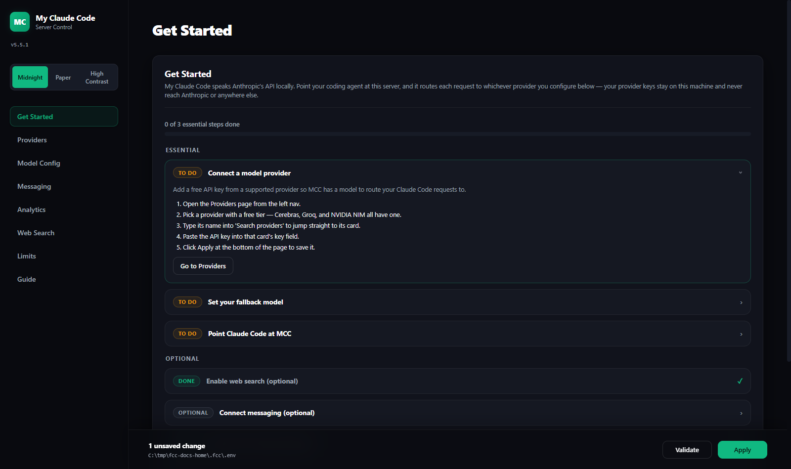
</div>

### 4. Run Your Coding Agent

Claude Code:

```bash
fcc-claude
```

`fcc-claude` sets only `ANTHROPIC_BASE_URL` and `ANTHROPIC_AUTH_TOKEN` on top of
your inherited shell environment — nothing else is changed or stripped. If you
want the previous behavior (also enables gateway model discovery, sets the
auto-compact window, disables telemetry/autoupdate, and clears any inherited
`ANTHROPIC_*` variables), use `fcc-claude-old` instead.

Codex:

```bash
fcc-codex
```

Pi:

```bash
fcc-pi
```

All three launchers use the current Admin UI settings. Use the agent's model picker to choose from the models FCC exposes. Normal CLI arguments still work, for example:

```bash
fcc-codex exec "hello"
```

`fcc-pi` registers FCC only for that Pi process; your existing Pi settings, sessions, credentials, and extensions remain unchanged.

<a id="install-troubleshooting"></a>

### Install Troubleshooting

| Symptom | Cause and fix |
| --- | --- |
| `fcc-server: command not found` right after installing | Your shell's `PATH` is stale. **Close and reopen the terminal.** If it persists, check that `~/.local/bin` (Windows: `%USERPROFILE%\.local\bin`) is on `PATH`. |
| The install stopped partway with an error about `claude`, `codex`, or `pi` | An old installer tried to install those for you and aborted when one failed. The current installer doesn't touch them at all — just re-run the command above. |
| I want Claude Code / Codex / Pi installed too | The installer no longer installs them. Install each from its own official installer; then `fcc-claude`, `fcc-codex`, and `fcc-pi` will launch them through the proxy. |
| `FCC release wheel checksum mismatch; refusing to install` | The download was corrupted or incomplete. Re-run the command. This check is deliberate: it will not install a wheel it can't verify. |
| PowerShell refuses to run the script | `Set-ExecutionPolicy -Scope Process -ExecutionPolicy Bypass`, then re-run. This only affects the current window. |
| Admin UI won't open, or settings don't seem to apply | You probably installed in **both** PowerShell and WSL and are editing one config while the server reads the other. Run `fcc-server --version` in each and pick one environment. |
| Server starts but the browser can't reach it | Use the exact URL from the startup log. In WSL, `http://127.0.0.1:8082/admin` works from a Windows browser via WSL's localhost forwarding. |
| `address already in use` on startup | A server is already running on that port. Stop it first, or set `PORT` to something else. |

Still stuck? Run the installer with `--dry-run` (PowerShell: `-DryRun`) and share the output — it prints every command it would run without changing anything.

## Connect Claude Code (CLI & Desktop)

Two ways to point Claude Code at your local FCC server (`http://127.0.0.1:8082`, auth token `freecc` — match these to the Admin UI if you changed them). No custom model overrides are needed in either case: FCC exposes native **Fable / Opus / Sonnet / Haiku** tier models, so Claude Code's built-in model picker works as-is.

### Claude Code CLI

Edit `~/.claude/settings.json` (`%USERPROFILE%\.claude\settings.json` on Windows) and **add the `env` block — or replace these two values if they already exist**:

```json
{
  "env": {
    "ANTHROPIC_AUTH_TOKEN": "freecc",
    "ANTHROPIC_BASE_URL": "http://127.0.0.1:8082"
  }
}
```

Notes:

- Keep any other keys you already have in the file — just merge the `env` entries.
- `ANTHROPIC_AUTH_TOKEN` sends the key as a bearer token (what FCC expects). The settings file wins over shell exports.
- Restart Claude Code after editing, then verify with `/status` — it should show `Anthropic base URL: http://127.0.0.1:8082` and your auth token.
- Official reference: [Claude Code LLM gateway docs](https://code.claude.com/docs/en/llm-gateway-connect) · [settings.json reference](https://code.claude.com/docs/en/settings).

### Claude Code Desktop

The desktop app routes its **Code tab** through the same `~/.claude/settings.json` above, but it also has a native gateway setting (no file editing). Menu labels vary slightly by app version — the current documented path is:

**1. Enable Developer Mode.** Open **Help → Troubleshooting → Enable Developer Mode**. The app restarts with a **Developer** menu. (On older builds: **Settings → enable Developer mode**, which exposes **Settings → Developer** instead.)

**2. Open Developer → Configure Third-Party Inference…**

<div align="center">
  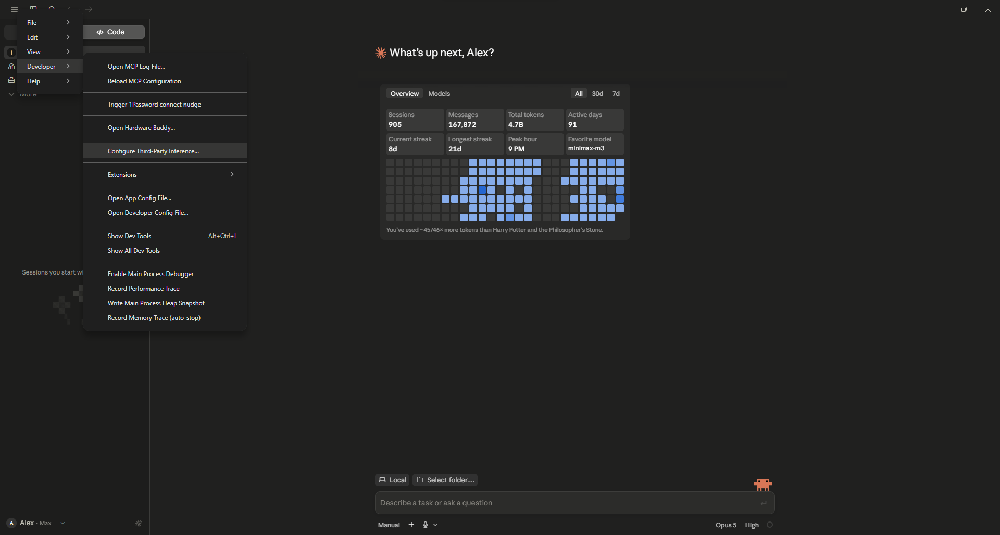
</div>

**3. Fill in the Connection section**, then click **Apply Changes**:

| Field | Value |
| --- | --- |
| **Connection** | `Gateway` |
| **Gateway base URL** | `http://127.0.0.1:8082` |
| **Gateway API key** | `freecc` |
| **Gateway auth scheme** | `bearer` |
| **Credential kind** | `Static API key` |
| **Model discovery** | on |

<div align="center">
  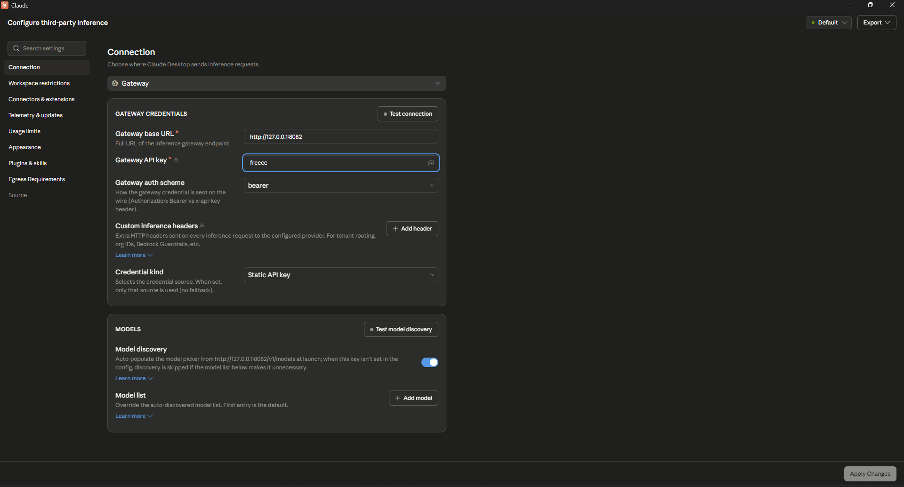
</div>

Use the port from your server's startup log if it isn't `8082`, and match the API key to `AUTH_TOKEN` if you changed it from the default `freecc`.

**4. Restart the app.**

**Test connection** and **Test model discovery** in that dialog both hit your running FCC server, so use them to confirm the setup before restarting — the server must be running for either to succeed.

With **Model discovery** on, the app auto-populates its picker from FCC's `/v1/models` at launch; you can leave **Model list** empty. The **initial warning dialog can be safely ignored** — the picker fills in once discovery completes. One limitation: with a gateway active, the desktop app runs **local sessions only** (no Anthropic-hosted cloud environments).

<a id="model-providers"></a>

## Model Providers

Enter the listed setting in the Admin UI, open **Model Config**, then search the `MODEL` dropdown and select a model. FCC constructs each slug as `<provider-id>/<exact-provider-model-id>`; free-text entry remains available when a provider cannot list a model. Click **Validate** and **Apply**. Provider names link to their key, model, or setup pages.

| Provider | Admin UI setting | Example `MODEL` |
| --- | --- | --- |
| [NVIDIA NIM](https://build.nvidia.com/settings/api-keys) | `NVIDIA_NIM_API_KEY` | `nvidia_nim/nvidia/nemotron-3-super-120b-a12b` |
| [OpenRouter](https://openrouter.ai/keys) | `OPENROUTER_API_KEY` | `open_router/openrouter/free` |
| [Google AI Studio (Gemini)](https://aistudio.google.com/apikey) | `GEMINI_API_KEY` | `gemini/models/gemini-3.1-flash-lite` |
| [DeepSeek](https://platform.deepseek.com/api_keys) | `DEEPSEEK_API_KEY` | `deepseek/deepseek-chat` |
| [Mistral La Plateforme](https://console.mistral.ai/) | `MISTRAL_API_KEY` | `mistral/devstral-small-latest` |
| [Mistral Codestral](https://console.mistral.ai/) | `CODESTRAL_API_KEY` | `mistral_codestral/codestral-latest` |
| [OpenCode Zen](https://opencode.ai/auth) | `OPENCODE_API_KEY` | `opencode/gpt-5.3-codex` |
| [OpenCode Go](https://opencode.ai/auth) | `OPENCODE_API_KEY` | `opencode_go/minimax-m2.7` |
| [Vercel AI Gateway](https://vercel.com/docs/ai-gateway/models-and-providers) | `AI_GATEWAY_API_KEY` | `vercel/openai/gpt-5.5` |
| [Hugging Face Inference Providers](https://huggingface.co/settings/tokens) | `HUGGINGFACE_API_KEY` | `huggingface/Qwen/Qwen3-Coder-480B-A35B-Instruct:fastest` |
| [Cohere](https://dashboard.cohere.com/api-keys) | `COHERE_API_KEY` | `cohere/command-a-plus-05-2026` |
| [GitHub Models](https://github.com/marketplace?type=models) | `GITHUB_MODELS_TOKEN` | `github_models/openai/gpt-4.1` |
| [Wafer](https://wafer.ai/) | `WAFER_API_KEY` | `wafer/DeepSeek-V4-Pro` |
| [Kimi](https://platform.moonshot.ai/console/api-keys) | `KIMI_API_KEY` | `kimi/kimi-k2.5` |
| [Kimi Coding](https://kimi.com/coding) | `KIMI_CODING_API_KEY` | `kimi_coding/kimi-k2.5` |
| [ChatGPT OAuth](https://github.com/openai/codex) (experimental) | `CHATGPT_OAUTH_ACCESS_TOKEN` + `CHATGPT_OAUTH_BASE_URL` | `chatgpt_oauth/gpt-5` |
| [MiniMax](https://platform.minimax.io/user-center/basic-information/interface-key) | `MINIMAX_API_KEY` | `minimax/MiniMax-M3` |
| [Cerebras Inference](https://cloud.cerebras.ai/) | `CEREBRAS_API_KEY` | `cerebras/gpt-oss-120b` |
| [Groq](https://console.groq.com/keys) | `GROQ_API_KEY` | `groq/llama-3.3-70b-versatile` |
| [SambaNova](https://cloud.sambanova.ai/apis) | `SAMBANOVA_API_KEY` | `sambanova/Meta-Llama-3.3-70B-Instruct` |
| [Fireworks AI](https://fireworks.ai/account/api-keys) | `FIREWORKS_API_KEY` | `fireworks/accounts/fireworks/models/llama-v3p3-70b-instruct` |
| [Novita AI](https://novita.ai/settings) | `NOVITA_API_KEY` | `novita/deepseek/deepseek-v3.2` |
| [Cloudflare Workers AI](https://developers.cloudflare.com/workers-ai/) | `CLOUDFLARE_API_TOKEN` and `CLOUDFLARE_ACCOUNT_ID` | `cloudflare/@cf/moonshotai/kimi-k2.6` |
| [Z.ai](https://z.ai/manage-apikey/apikey-list) | `ZAI_API_KEY` | `zai/glm-5.2` |
| [Ollama Cloud](https://ollama.com/settings/keys) | `OLLAMA_API_KEY` | `ollama_cloud/qwen3-coder:480b` |
| [LM Studio](https://lmstudio.ai/) | `LM_STUDIO_BASE_URL` | `lmstudio/<model-id>` |
| [llama.cpp](https://github.com/ggml-org/llama.cpp) | `LLAMACPP_BASE_URL` | `llamacpp/<model-id>` |
| [Ollama](https://ollama.com/) | `OLLAMA_BASE_URL` | `ollama/<model-tag>` |

Important provider notes:

- Mistral Codestral uses a separate key from Mistral La Plateforme.
- OpenCode Zen and OpenCode Go share `OPENCODE_API_KEY` but use different model prefixes.
- Cloudflare requires both its API token and account ID.
- Ollama Cloud connects directly to `ollama.com`; use the exact model IDs shown
  by FCC's model picker. Local Ollama remains available through the separate
  `ollama/` prefix.
- Prefer tool-capable models for coding agents. Local models also need enough context for the agent's system prompt and tool definitions.

<details>
<summary><strong>Local provider setup</strong></summary>

### LM Studio

Start LM Studio's local server, load a tool-capable model, and use the model identifier shown by LM Studio with the `lmstudio/` prefix. The default URL is `http://localhost:1234/v1`.

### llama.cpp

Start `llama-server` with its OpenAI-compatible Chat Completions API and enough context for the model. Use the local model ID with the `llamacpp/` prefix. `LLAMACPP_BASE_URL` defaults to `http://localhost:8080/v1`; FCC accepts either the server root or an explicit `/v1` suffix.

### Ollama

```bash
ollama pull llama3.1
ollama serve
```

Use the tag shown by `ollama list` with the `ollama/` prefix. `OLLAMA_BASE_URL` defaults to `http://localhost:11434`; FCC accepts either the root URL or an explicit `/v1` suffix.

</details>

<a id="model-provider-key-rotation"></a>

### Multi-Key Rotation

Put multiple API keys in one variable, comma-separated, and choose a policy with `{ENV}_ROTATION`:

```bash
OPENROUTER_API_KEY="sk-or-key1,sk-or-key2,sk-or-key3"
OPENROUTER_API_KEY_ROTATION=round_robin
```

Policies:

| Policy | Behavior |
| --- | --- |
| `single` | Always the first key (default when one key is set). |
| `round_robin` | Spread requests across healthy keys in turn. |
| `least_used` | Healthy key with the fewest requests goes first. |
| `failover` (alias `on_error`) | Stick to the first healthy key until it fails, then move to the next (default when multiple keys are set). |

Each key gets its own upstream client and its own rate-limit window, so one key saturating or stalling never throttles the others.

**Health model.** A key that fails is benched with tiered cooldowns (10s → 30s → 60s → 120s); three consecutive failures open the circuit until the cooldown elapses, after which a **single** half-open probe is allowed through — concurrent requests are routed to other keys rather than stampeding the recovering one. A successful probe restores the key; a failed probe re-benches it at the next tier. Auth failures (401/403) trigger an escalating lockout (5 min → 1 h → 24 h) on their own counter, so unrelated transient errors can't push a healthy key toward the long lockout.

Rate limits (429) escalate the cooldown ladder but deliberately do **not** open the circuit — a throttled key isn't a broken one.

**Availability, not just health.** A key can be perfectly healthy and still unable to serve right now: rate-limited, or out of daily budget. Rotation skips those keys and picks one that can answer immediately, instead of queueing behind a throttled key while an idle key sits unused. If *every* key is unavailable the request still goes out rather than failing — a soft guardrail should never become a self-inflicted outage.

**Provider-declared backoff.** On a 429, FCC reads the upstream's own `Retry-After`, `retry-after-ms`, and `X-RateLimit-Reset-*` headers (all the formats providers actually ship, including `6m0s` and `250ms`) and waits exactly that long, capped at an hour. Only when a provider says nothing does it fall back to a fixed minute.

**No invented ceilings.** FCC never caps a key at a number it made up. Every limit it applies comes from the provider's own response — the reset window on a 429, the status on a rejection. Providers change their limits without notice, so a hardcoded budget is wrong the moment it ships; reading what the upstream actually reports stays right.

**When rotation happens.** Only for errors another key could actually fix: authentication, rate limits, 5xx/overload, and transport failures. A plain 400 fails identically on every key and is not rotated. Failover happens before the first streamed chunk; once output has started, switching credentials would corrupt the response, so a mid-stream failure is recorded against the key but propagated to the client.

All of this is visible and manageable from **Admin UI → Providers → Manage keys**, which shows per-key state and usage and lets you reset keys, plus a **Test** button per provider. For historical per-key request volume, error rate, tokens, and latency, see [Per-Key Attribution](#per-key-attribution).

Web search provider keys share the same rotation engine — see [Web Search → Multi-key rotation](#multi-key-rotation-web-search-keys).

### Optional Model-Tier Routing

`MODEL` is the fallback for every request. Select a model for `MODEL_FABLE`, `MODEL_OPUS`, `MODEL_SONNET`, or `MODEL_HAIKU` to override an individual Claude Code tier; select **None** to use `MODEL`.

For example, route Opus to `nvidia_nim/moonshotai/kimi-k2.6`, Sonnet to `open_router/openrouter/free`, Haiku to `lmstudio/qwen3.5-coder`, and keep `MODEL` on `zai/glm-5.2`.

### Reasoning Control

Open **Admin UI → Model Config → Reasoning** to choose how FCC handles client reasoning controls. The default **From client** option preserves reasoning effort sent by Claude Code, Codex, or Pi; when the client sends no control, the provider keeps its own default.

You can instead select **Off**, **Low**, **Medium**, **High**, **X-High**, or **Max**. Fable, Opus, Sonnet, and Haiku each have the same choices plus **Inherit**, which uses the root policy. Providers with named effort receive those names; numeric-budget providers map **Low=512**, **Medium=1,024**, **High=2,048**, **X-High=4,096**, and **Max=8,192** reasoning tokens; boolean providers receive on or off. Unsupported controls safely remain provider-defined.

<div align="center">
  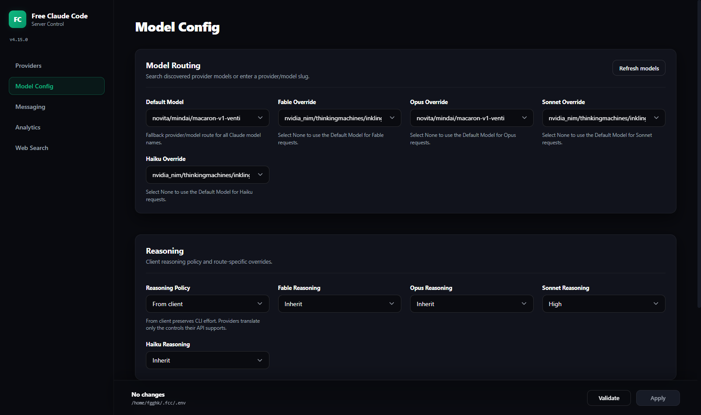
  <p><em>Model Config: the fallback <code>MODEL</code> picker, per-tier routing, and reasoning control.</em></p>
</div>

<a id="web-search"></a>

## Web Search

Claude Code's `web_search` is an Anthropic **server tool**: normally Anthropic's servers execute the search and bill you for it. FCC fulfills that server tool at the proxy level instead — the client emits a `web_search` tool-use block, FCC runs the search against a provider you choose (or the keyless default), and streams the results back as a regular text block. No Anthropic search credits are used, and the whole flow works with any model provider.

<div align="center">
  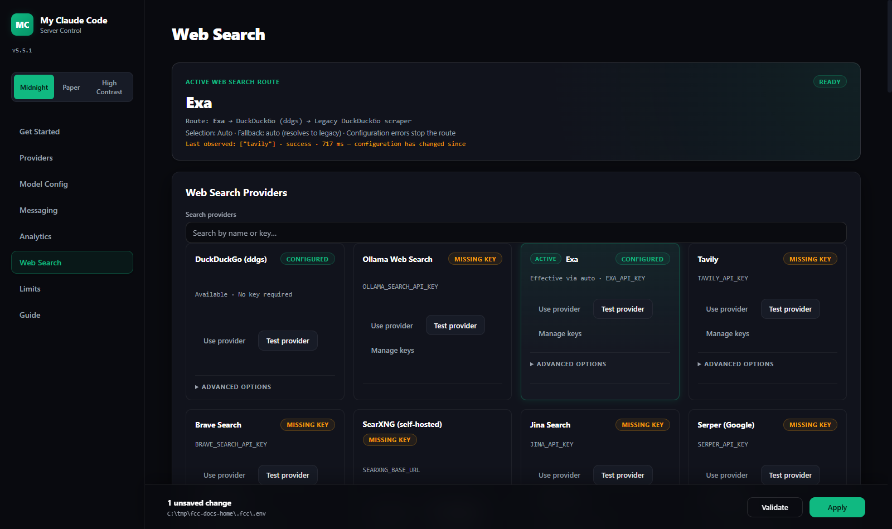
  <p><em>Web Search view: route summary, provider cards, key health, and its own analytics.</em></p>
</div>

### Search Providers

FCC supports 14 search backends, resolved by `WEB_SEARCH_PROVIDER`:

| Provider | Env var | Free tier | Get a key |
| --- | --- | --- | --- |
| DuckDuckGo (`ddgs`) | — (keyless) | Free, keyless (unofficial metasearch; engines may IP-rate-limit) | — |
| Ollama Web Search | `OLLAMA_SEARCH_API_KEY` | Free hosted tier with a free Ollama account | [ollama.com/settings/keys](https://ollama.com/settings/keys) |
| Exa | `EXA_API_KEY` | $20 signup credit + $10/month free ongoing | [dashboard.exa.ai/api-keys](https://dashboard.exa.ai/api-keys) |
| Tavily | `TAVILY_API_KEY` | 1,000 credits/month free, no card | [app.tavily.com/home](https://app.tavily.com/home) |
| Brave Search | `BRAVE_SEARCH_API_KEY` | $5 in free credits every month | [api-dashboard.search.brave.com](https://api-dashboard.search.brave.com/) |
| SearXNG | `SEARXNG_BASE_URL` | Free, self-hosted (AGPL); instance must enable `format=json` | self-hosted |
| Jina Search | `JINA_API_KEY` | 10M free tokens for new keys | [jina.ai/api-dashboard](https://jina.ai/api-dashboard/) |
| Serper (Google) | `SERPER_API_KEY` | 2,500 free one-time queries | [serper.dev/api-key](https://serper.dev/api-key) |
| Firecrawl | `FIRECRAWL_API_KEY` | One-time free credit grant on signup | [firecrawl.dev/app/api-keys](https://www.firecrawl.dev/app/api-keys) |
| Linkup | `LINKUP_API_KEY` | $20 free credit, topped back up monthly | [app.linkup.so](https://app.linkup.so/) |
| Perplexity Search | `PERPLEXITY_SEARCH_API_KEY` | No meaningful free tier (prepaid credit; mint a fresh key) | [perplexity.ai/settings/api](https://www.perplexity.ai/settings/api) |
| Parallel | `PARALLEL_API_KEY` | Pay-per-use from $0.005 per 10 results | [platform.parallel.ai](https://platform.parallel.ai/) |
| SearchAPI.io | `SEARCHAPI_API_KEY` | 100 free one-time requests | [searchapi.io](https://www.searchapi.io/) |
| SerpAPI | `SERPAPI_API_KEY` | 250 free searches/month | [serpapi.com/manage-api-key](https://serpapi.com/manage-api-key) |

`WEB_SEARCH_PROVIDER` accepts `auto` (default), `off`, `disabled`, or one of the provider IDs `ddgs | ollama | exa | tavily | brave | searxng | jina | serper | firecrawl | linkup | perplexity | parallel | searchapi | serpapi`:

- **`auto`** picks the first configured provider in catalog order; with no keys set it falls back to keyless `ddgs`, so search works **zero-config out of the box**.
- **`off`** preserves the legacy DuckDuckGo HTML scraper without using the provider registry.
- **`disabled`** rejects web searches without making an outbound search request.
- An explicit ID pins that provider and is strict by default: missing credentials or upstream failure are surfaced instead of silently changing providers.

`WEB_SEARCH_FALLBACK_POLICY` controls the route after the selected provider:

| Policy | Behavior |
| --- | --- |
| `auto` (default) | `WEB_SEARCH_PROVIDER=auto` uses selected → DDGS → legacy; a named provider is strict |
| `none` | Selected provider only |
| `ddgs` | Selected provider → DDGS |
| `legacy` | Selected provider → DDGS → legacy scraper |

Configuration failures such as a missing API key always fail visibly. DDGS is never attempted twice, and the rich digest identifies the provider that ultimately produced the results.

Minimal `.env` example (two keys with round-robin, see below):

```bash
WEB_SEARCH_PROVIDER=auto
WEB_SEARCH_FALLBACK_POLICY=auto
TAVILY_API_KEY="tvly-key1,tvly-key2"
TAVILY_API_KEY_ROTATION=round_robin
# Optional outbound proxy for web search (http/socks5):
WEBSEARCH_PROXY=""
```

You can also configure everything from **Admin UI → Web Search**. The route summary shows the complete configured chain and the last observed terminal route; the effective card is highlighted, providers can be selected directly, and each card exposes testing, key health, rotation, and advanced options. Deep per-provider pricing, free-tier details, and a capability matrix live in [research/web-search-providers.md](research/web-search-providers.md) and [research/web-search-advanced.md](research/web-search-advanced.md).

### Multi-key rotation (web search keys)

Comma-separate multiple keys in the same variable and pick a policy via `{ENV}_ROTATION`:

```bash
EXA_API_KEY="exa-key-a,exa-key-b,exa-key-c"
EXA_API_KEY_ROTATION=failover   # single | round_robin | least_used | failover (on_error)
```

The default is `failover` when multiple keys are set, `single` otherwise. Web search keys share the same engine and health semantics as model provider keys — see [Model Providers → Multi-Key Rotation](#model-provider-key-rotation).

### Advanced options

Each provider exposes dotenv-only knobs (never in pydantic Settings); empty/unset values reproduce default behavior exactly. All of them are editable from the Web Search tab's **Advanced options** drawers. Highlights — cost warnings apply as noted:

| Provider | Notable options |
| --- | --- |
| Exa | `EXA_SEARCH_TYPE` (`deep*` = $0.015/query vs $0.005), `EXA_CONTENTS` modes incl. `full` (+$0.001/page per content type), `EXA_CATEGORY` verticals (company/people disable date+exclude filters), `EXA_MAX_AGE_HOURS`, published-date bounds, `EXA_USER_LOCATION` |
| Brave | `BRAVE_SEARCH_MODE=llm-context` ($5/1k, returns pre-extracted page text), `BRAVE_LLM_MAX_TOKENS` (1024–32768, llm-context only), `BRAVE_FRESHNESS`, country/language, plan-gated `BRAVE_EXTRA_SNIPPETS`, `BRAVE_SAFESEARCH` |
| Tavily | `TAVILY_SEARCH_DEPTH=advanced` (2 credits/query), `TAVILY_TOPIC`, `TAVILY_TIME_RANGE`, `TAVILY_INCLUDE_ANSWER` (basic/advanced LLM answer lead), `TAVILY_INCLUDE_RAW_CONTENT` (free full page text, may add latency), `TAVILY_CHUNKS_PER_SOURCE` (1–3, more text per result), `TAVILY_COUNTRY`, `TAVILY_START_DATE`/`TAVILY_END_DATE` |
| Serper | `SERPER_GL`/`SERPER_HL`/`SERPER_TBS`, `SERPER_RICH_BLOCKS` (default on: answerBox/knowledgeGraph/peopleAlsoAsk feed the answer lead) |
| Linkup | `LINKUP_DEPTH=deep` (10x cost, $0.05/query), `LINKUP_OUTPUT_TYPE=sourcedAnswer` (+$0.001, returns answer+sources), `LINKUP_FROM_DATE`/`LINKUP_TO_DATE` |
| Perplexity | `PERPLEXITY_SEARCH_RECENCY`, `PERPLEXITY_CONTEXT_SIZE` (omitted when `PERPLEXITY_MAX_TOKENS_PER_PAGE` is set) |
| Parallel | `PARALLEL_MODE` (turbo cheapest → advanced highest quality), `PARALLEL_EXCERPT_CHARS`, `PARALLEL_TOTAL_CHARS`, `PARALLEL_LOCATION` |
| Firecrawl | `FIRECRAWL_SOURCES` (web/news/images), `FIRECRAWL_SCRAPE_FORMAT` summary/markdown (multiplies credits per result), `FIRECRAWL_TBS`, `FIRECRAWL_LOCATION`, `FIRECRAWL_COUNTRY` (provider defaults to US), `FIRECRAWL_CATEGORIES` (github/research/pdf) |
| Jina | `JINA_MAX_TOKENS` (token-billed; best cost guardrail), `JINA_SITE`, `JINA_GL` |
| SearXNG | `SEARXNG_ENGINES`, `SEARXNG_CATEGORIES`, `SEARXNG_TIME_RANGE`, `SEARXNG_LANGUAGE`, `SEARXNG_SAFESEARCH` |
| ddgs | `DDGS_BACKEND` (pin one free engine to dodge per-engine rate limits), `DDGS_REGION`, `DDGS_TIMELIMIT`, `DDGS_SAFESEARCH` |
| SerpAPI | `SERPAPI_ENGINE` (`google_light` is cheaper, `num=100` works), `SERPAPI_TBS`, `SERPAPI_GL`, `SERPAPI_HL`, `SERPAPI_SAFE` |
| SearchAPI.io | `SEARCHAPI_ENGINE` (google/news/scholar/bing), `SEARCHAPI_TIME_PERIOD`, `SEARCHAPI_GL`, `SEARCHAPI_HL`, `SEARCHAPI_SAFE` |

Every option's drawer states what leaving it blank does, so an empty field always reproduces the provider's own default. See the **Web Search Advanced Options** block in [.env.example](.env.example) for the full list with inline cost notes.

### Rich digest

Search results are rendered as a richer digest than a plain title/URL list: an optional provider **answer lead** (from Exa/Tavily/Linkup/Serper rich blocks, etc.), then numbered results with title, publication date (`page_age` where the provider exposes it), URL, and an excerpt capped per result:

```bash
WEBSEARCH_DIGEST_CHARS=600           # per-result snippet cap
WEBSEARCH_DIGEST_CONTENT_CHARS=2000  # per-result cap for extracted page text
WEBSEARCH_DIGEST_ANSWER=true         # include the provider answer lead
```

### Giving the model full page text, not just snippets

By default most providers return a one- or two-sentence snippet per result. Several can return the **extracted text of the page itself**, which is usually the difference between the model guessing from a summary and actually reading the source.

Turn it on per provider, then give it room:

```bash
# Pick whichever provider you use — each has its own switch:
EXA_CONTENTS=text                    # or highlights+text, full
TAVILY_INCLUDE_RAW_CONTENT=markdown  # or text
FIRECRAWL_SCRAPE_FORMAT=markdown     # or summary
BRAVE_EXTRA_SNIPPETS=true            # plan-gated

WEBSEARCH_DIGEST_CONTENT_CHARS=4000  # how much of it reaches the model
```

Jina, Parallel and Linkup return extracted text by default and need no switch.

Extracted text has its **own, larger cap** (`WEBSEARCH_DIGEST_CONTENT_CHARS`) rather than sharing the snippet cap, so opting into content isn't silently trimmed back to snippet length. Raise it for more grounding, lower it to control input tokens, or set it to `0` to keep snippets only.

> **Cost:** content options bill more on most providers (Firecrawl multiplies credits per result; Exa charges per content type) and increase input tokens on every search. Check the option's drawer in the Admin UI — each states its cost.

### Restricting searches to specific sites

Claude Code declares `allowed_domains`, `blocked_domains`, and `max_uses` on its `web_search` tool definition. FCC reads them from the request and forwards them, so:

```json
{ "type": "web_search_20250305", "name": "web_search",
  "allowed_domains": ["docs.python.org", "peps.python.org"] }
```

restricts results **server-side** on Exa, Tavily, Firecrawl, Linkup, Perplexity and Parallel — you pay for relevant results rather than filtering afterwards. Providers without native support drop the filters and search normally; every recorded attempt shows `supports_domain_filters`, so the analytics detail view tells you which happened.

Anthropic rejects requests carrying both lists, so if both arrive the allow list wins rather than silently intersecting them.

### Safe search, locale and freshness

Safe search is available on the providers that document it:

```bash
BRAVE_SAFESEARCH=strict      # off | moderate | strict
SEARXNG_SAFESEARCH=2         # 0 | 1 | 2
SERPAPI_SAFE=active          # active | off
SEARCHAPI_SAFE=active        # active | blur | off
DDGS_SAFESEARCH=strict
```

Locale is per provider and worth setting if you are not in the US — **Firecrawl defaults to US results unless told otherwise**:

```bash
FIRECRAWL_COUNTRY=DE
TAVILY_COUNTRY=germany
BRAVE_COUNTRY=DE
SERPER_GL=de           # SERPAPI_GL / SEARCHAPI_GL / JINA_GL are the same idea
PARALLEL_LOCATION=DE
```

Freshness uses each provider's own vocabulary (`BRAVE_FRESHNESS=pw`, `TAVILY_TIME_RANGE=week`, `SERPER_TBS=qdr:w`, …). For a precise window rather than a relative one, several providers now take explicit dates:

```bash
TAVILY_START_DATE=2026-01-01
TAVILY_END_DATE=2026-06-30
LINKUP_FROM_DATE=2026-01-01
EXA_START_PUBLISHED_DATE=2026-01-01
```

Two more worth knowing:

- `TAVILY_CHUNKS_PER_SOURCE=3` — more snippets per source, the cheapest way to get more text out of Tavily without raw content.
- `FIRECRAWL_CATEGORIES=github,research` — restrict to GitHub or research papers, which is often exactly what a coding question wants.

### How failures are reported

Search failures come back to the client as a proper `web_search_tool_result_error` with the error code that matches what happened, so a client can react correctly rather than treating everything as a generic outage:

| What happened | Code the client sees |
| --- | --- |
| Rate limited or plan quota exhausted | `too_many_requests` |
| Request rejected by the provider | `invalid_tool_input` |
| `max_uses` budget leaves no room | `max_uses_exceeded` |
| Anything else | `unavailable` |

**Rate limits use the provider's own reset time.** When a provider returns 429 it usually says when the limit clears (`Retry-After`, `retry-after-ms`, `x-ratelimit-reset-*`); FCC honours that instead of assuming a fixed cooldown, so a key that resets in a second isn't benched for a minute and one that needs an hour isn't hammered. If the provider says nothing, a conservative default applies. Nothing is capped by an invented ceiling — the only bound is a 1-hour sanity limit on what a single header can request.

### Web search analytics

Every logical search and each provider attempt are recorded by a non-blocking background writer in `~/.fcc/logs/websearch.db`. Route records include a correlation ID, primary and terminal providers, the attempted chain, fallback use, final status, end-to-end latency, results, and known cost. Attempt records additionally retain the complete normalized tool input and provider output: full query and domain parameters, provider answer/rich summary, every result's title/URL/snippet/full content/publication date, result count and cost. A redacted snapshot preserves the effective provider, route/fallback policy, base URL, proxy endpoint without credentials, timeout, rotation policy, credential count, capabilities, and advanced options used for that attempt. Legacy scraper outcomes use the same detail shape.

The Admin UI keeps the two levels explicit: top cards and the main trend chart report logical searches, route success/fallback rate, average attempts, and end-to-end latency, while provider/key tables and recent rows report individual attempts. Each recent row has an accessible **View** dialog with effective configuration, tool input, a readable answer/result summary, and the complete normalized output JSON. Filtering searches captured input/output as well as query previews, and JSON export includes the captured detail payloads. Existing pre-4.12 attempt history remains visible, but logical-route metrics begin with 4.12:

```bash
WEBSEARCH_LOG_ENABLED=true
WEBSEARCH_LOG_MAX_ROWS=50000   # retention cap; oldest rows pruned
WEBSEARCH_LOG_CAPTURE_CONTENT=true      # false keeps lengths + SHA-256 only
WEBSEARCH_LOG_CONTENT_MAX_CHARS=50000   # cap per input/output JSON payload
```

Oversized payloads are stored as valid JSON truncation envelopes containing the original length, SHA-256, and a bounded preview. API keys are never copied into configuration snapshots, secret-looking object fields are redacted, and proxy/userinfo credentials are removed. Search content still commonly includes private queries, result URLs, and page text. `WEBSEARCH_LOG_CAPTURE_CONTENT=false` withholds the captured input/output payloads **and the query text itself**, keeping only lengths and SHA-256 hashes, so the switch covers everything a search reveals. Set `WEBSEARCH_LOG_ENABLED=false` to record nothing at all.

<a id="admin-dashboard"></a>

## Admin Dashboard

The Admin UI (`http://127.0.0.1:8082/admin`, local-only) is the control center for the whole proxy:

- **Providers** — API keys, model catalog, **Validate** / **Apply**, per-provider **Test**, and **Manage keys** for multi-key rotation state (per-key health/usage, key reset).
- **Model Config** — the `MODEL` picker, model-tier routing (`MODEL_FABLE` / `MODEL_OPUS` / `MODEL_SONNET` / `MODEL_HAIKU`), and reasoning control.
- **Web Search** — configured and last-observed route summaries, strict/fallback policy, provider cards, key health, advanced options, separate route/attempt analytics, and full captured input/output drill-down.
- **Analytics** — the full model-request observability dashboard (see below).
- **Messaging** — Discord/Telegram bot and voice-note settings.
- **Version** — running version, update announcements, and one-click upgrades (see [Version & Updates](#version--updates)).

<div align="center">
  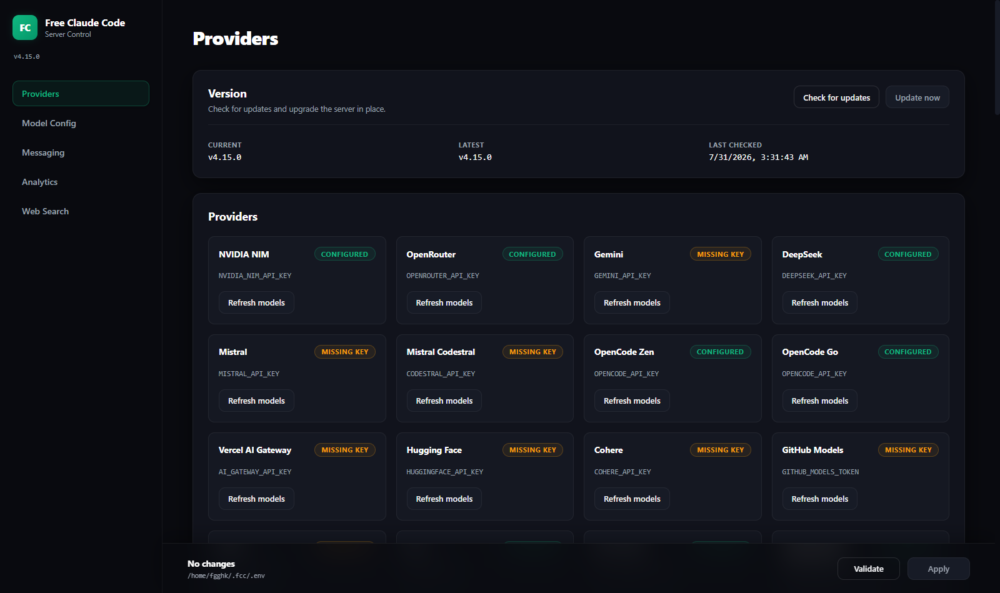
  <p><em>Providers view. The version panel sits at the top; the running version is always visible in the sidebar.</em></p>
</div>

### Request Analytics

FCC keeps a persistent log of every completed request (non-blocking background writer, SQLite at `~/.fcc/logs/requests.db`) and surfaces it in **Admin UI → Analytics**. Each record captures endpoint/protocol, requested and resolved model, provider, stream flag, input/output text (capped at 50k chars) with SHA-256 hashes and lengths, reasoning and params, token counts, TTFT and duration, status (success/error/cancelled), and error details. Every filter (provider/model/status/endpoint/search/time range) applies consistently to metric cards, linearly interpolated p50/p95 latency, provider/model breakdowns, top errors, charts, and the request table. The dashboard adds race-safe auto-refresh, page-size controls, accessible chart legends, provider performance, JSON export, keyboard-friendly request details, explicit unavailable/stale states, and an unambiguous clear-all action (`/admin/api/requests*` endpoints back it).

```bash
REQUEST_LOG_ENABLED=true
REQUEST_LOG_MAX_ROWS=50000        # retention cap; oldest rows pruned periodically
REQUEST_LOG_CAPTURE_BODIES=true   # false stores only body lengths + SHA-256 hashes
```

**Privacy note:** request bodies are stored locally on disk by default. They never leave your machine, but set `REQUEST_LOG_CAPTURE_BODIES=false` (or disable the log entirely) if you'd rather not persist conversation text.

<div align="center">
  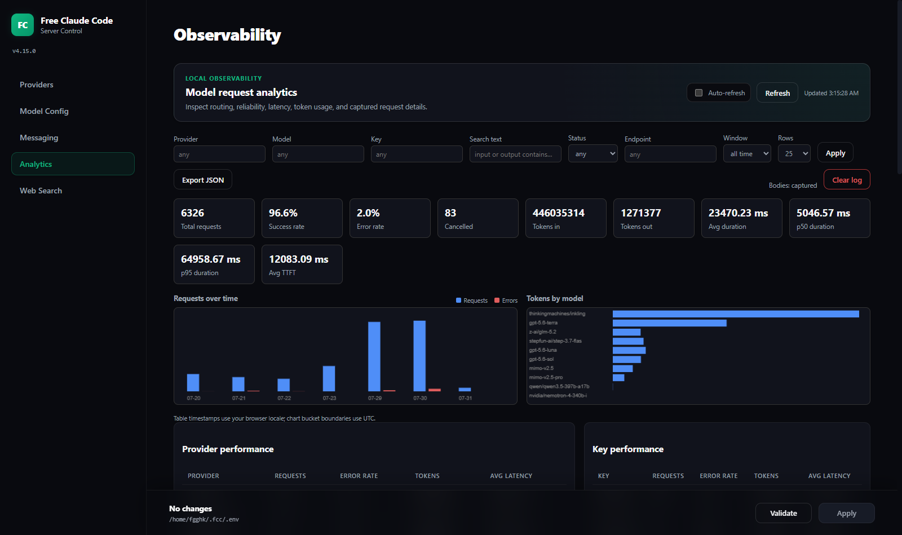
  <p><em>Analytics overview: metric cards, requests over time, and tokens by model — all obeying the same filter row.</em></p>
</div>

#### Per-Key Attribution

Every request records **which credential served it**, so a multi-key pool is no longer a black box. The Analytics view adds a **Key** column to the request table, a **Key performance** panel, and a **Key** filter that composes with every other filter.

Credentials are identified by a masked `first4…last4` label and their pool index. **The raw key is never written to the database, a log line, or any HTTP response.**

<div align="center">
  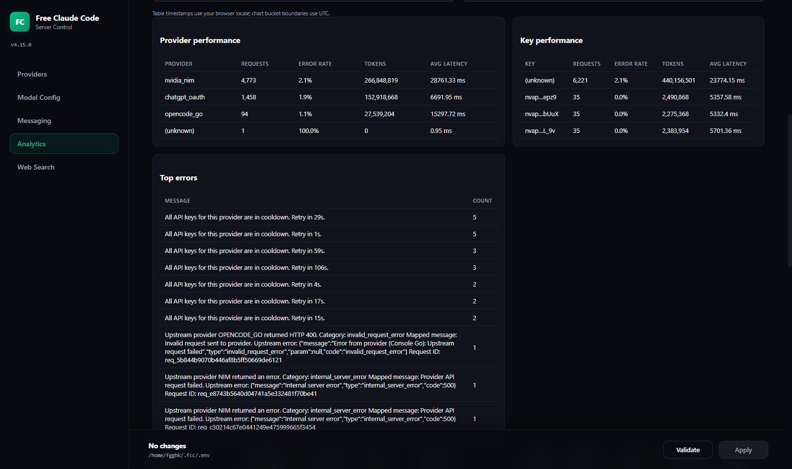
  <p><em>Per-key breakdown. Here a three-key NVIDIA NIM pool under <code>round_robin</code> has served 32 / 32 / 31 requests — an even spread. Rows logged before per-key tracking existed show as <code>(unknown)</code>.</em></p>
</div>

<div align="center">
  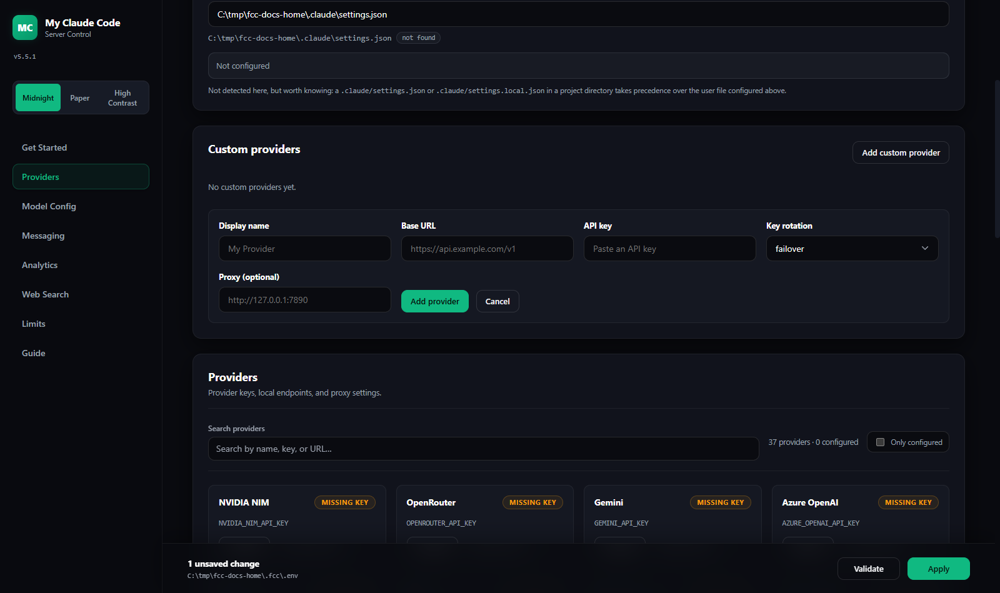
  <p><em>The request table showing rotation in action: consecutive requests cycle across the three keys. Request and response bodies are not shown in the table — they live behind <strong>View</strong>.</em></p>
</div>

<a id="version--updates"></a>

## Version & Updates

The running version is always visible in the Admin UI sidebar. **Providers → Version** shows the current version, the latest published release, and when the check last ran.

FCC checks the GitHub releases feed when the dashboard loads, caching the result for six hours so it never hammers the API. **Check for updates** forces a fresh check. If the machine is offline or GitHub is unreachable, the panel still shows your running version and notes that the check failed — it never blocks the dashboard.

When a newer release exists, a banner announces it and carries the release notes inline. Expand **What changed** to read them without leaving the dashboard — a version number on its own rarely tells you whether an update is worth taking. The link to the full release page is still there for anything trimmed:

<div align="center">
  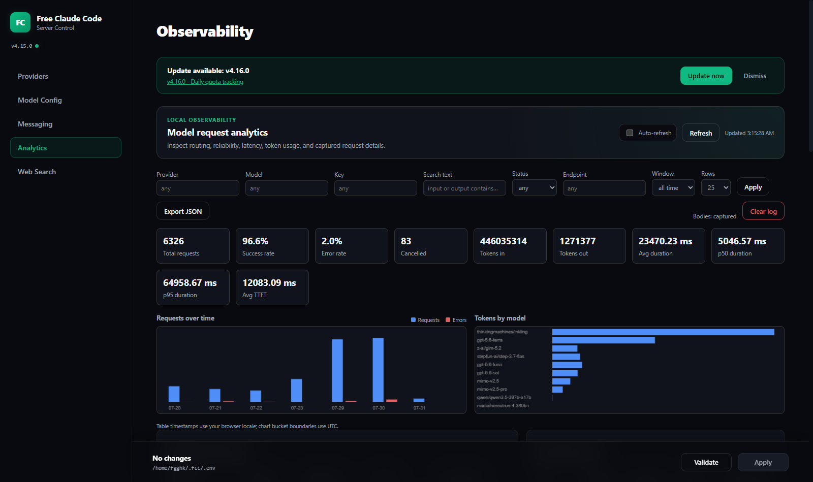
  <p><em>Update announcement. Dismissal is remembered per version, so hiding one release still surfaces the next.</em></p>
</div>

**Update now** performs the same steps as the install script: download the release wheel, verify its SHA-256 against the digest GitHub publishes, and install it with `uv`. A checksum mismatch aborts the install. Any extras you originally installed (such as voice support) are detected and preserved, so upgrading never silently drops a feature.

**Upgrading does not restart the server.** A running process keeps serving the code it already loaded, so an upgrade can never drop an in-flight Claude Code stream. Once the install finishes you get a *restart required* banner; restart `fcc-server` whenever it suits you and the new version takes effect.

**On Windows the install is deferred until you stop the server.** Windows holds the running interpreter and its loaded DLLs open, so the environment cannot be replaced underneath a live process — attempting it fails partway through and leaves a broken install. Instead, **Update now** downloads and checksum-verifies the wheel, then hands it to a detached helper that waits for `fcc-server` to exit and installs it then. You'll see *"Update staged — stop the server to finish installing"*: stop the server, the update applies by itself, and you start it again on the new version. Your current install stays untouched and fully working until that moment, so a failed update can't strand you — and if the deferred install does fail, the dashboard tells you on the next start. WSL, Linux and macOS install in place as before, because they can replace files that are still open.

If `uv` is not on `PATH`, the upgrade declines and tells you to re-run the install script instead. These endpoints (`/admin/api/version*`) are loopback-only, like the rest of the Admin API.

Prefer the command line? Re-running the install command from [Quick Start](#install) does exactly the same thing.

<a id="oauth-providers"></a>

## OAuth Providers

### ChatGPT OAuth Provider (experimental)

FCC can talk directly to `chatgpt.com/backend-api/codex/responses` (OpenAI Responses API) using your ChatGPT subscription's OAuth tokens. Four login paths:

1. **Admin UI → Log in with device code** — the default and recommended path; it works across Windows/WSL, SSH, containers, and other remote environments without a localhost callback.
2. **Admin UI → Browser login (same device)** — browser PKCE for cases where the browser and FCC definitely share the same localhost. Do not use it when FCC runs in WSL and the browser runs on Windows.
3. `fcc-chatgpt-oauth-login` — browser PKCE locally, with immediate device-code fallback under WSL/remote sessions or when the callback cannot start. `--device` forces device login; `--browser` explicitly confirms a same-localhost browser.
4. **Import Codex CLI Tokens** — after `codex login`, copy the complete renewable credential bundle into FCC without modifying `~/.codex/auth.json`.

FCC stores its renewable credentials separately at `~/.fcc/auth/chatgpt-oauth.json`. The Admin API and `.env` contain only a non-secret managed-credential reference. A raw `CHATGPT_OAUTH_ACCESS_TOKEN` remains supported as an advanced override, but it cannot be refreshed.

Supported models include `chatgpt_oauth/gpt-5.5`, `chatgpt_oauth/gpt-5.4`, `chatgpt_oauth/gpt-5.4-mini`, and `chatgpt_oauth/gpt-5.3-codex-spark`. Optional overrides: `CHATGPT_OAUTH_ACCOUNT_ID`, `CHATGPT_OAUTH_BASE_URL`, `CHATGPT_OAUTH_PROXY`.

**ChatGPT OAuth is experimental and unsanctioned.** It is not an official OpenAI API product. The ChatGPT/Codex backend only exposes a limited set of built-in tools, so custom FCC tools may be rejected; use it at your own risk.

### Kimi For Coding Provider

Moonshot's coding-plan endpoint, separate from the standard Kimi platform: OpenAI-compatible at `api.kimi.com/coding/v1`. Set `KIMI_CODING_API_KEY` from [kimi.com/coding](https://kimi.com/coding) and pick a model such as `kimi_coding/kimi-k2.5`.

<a id="connect-your-client"></a>

## Connect Your Client

For terminal use, start `fcc-server`, then run `fcc-claude`, `fcc-codex`, or `fcc-pi`. Use the guides below for editor integrations.

<details>
<summary><strong>Claude Code in VS Code</strong></summary>

Install the [Claude Code extension](https://marketplace.visualstudio.com/items?itemName=anthropic.claude-code). Open VS Code's user settings as JSON and add:

```json
"claudeCode.disableLoginPrompt": true,
"claudeCode.environmentVariables": [
  { "name": "ANTHROPIC_BASE_URL", "value": "http://localhost:8082" },
  { "name": "ANTHROPIC_AUTH_TOKEN", "value": "freecc" },
  { "name": "CLAUDE_CODE_ENABLE_GATEWAY_MODEL_DISCOVERY", "value": "1" },
  { "name": "CLAUDE_CODE_AUTO_COMPACT_WINDOW", "value": "190000" },
  { "name": "DISABLE_AUTOUPDATER", "value": "1" },
  { "name": "DISABLE_FEEDBACK_COMMAND", "value": "1" },
  { "name": "DISABLE_ERROR_REPORTING", "value": "1" },
  { "name": "DISABLE_TELEMETRY", "value": "1" }
]
```

Match the port and authentication token to the Admin UI, then reload the extension.

</details>

<details>
<summary><strong>Codex in VS Code</strong></summary>

Install the [Codex extension](https://marketplace.visualstudio.com/items?itemName=openai.chatgpt). Create or edit `~/.codex/config.toml` (`%USERPROFILE%\.codex\config.toml` on Windows):

```toml
model_provider = "fcc"
model = "nvidia_nim/nvidia/nemotron-3-super-120b-a12b"

[model_providers.fcc]
name = "Free Claude Code"
base_url = "http://127.0.0.1:8082/v1"
http_headers = { Authorization = "Bearer freecc" }
wire_api = "responses"
```

Match `model`, the port, and bearer token to the Admin UI, then restart VS Code. For WSL-backed Codex, edit the file inside WSL.

</details>

<details>
<summary><strong>Claude Code in JetBrains ACP</strong></summary>

Edit the installed Claude ACP configuration:

- Windows: `C:\Users\%USERNAME%\AppData\Roaming\JetBrains\acp-agents\installed.json`
- Linux/macOS: `~/.jetbrains/acp.json`

Set the environment for `acp.registry.claude-acp`:

```json
"env": {
  "ANTHROPIC_BASE_URL": "http://localhost:8082",
  "ANTHROPIC_AUTH_TOKEN": "freecc",
  "CLAUDE_CODE_ENABLE_GATEWAY_MODEL_DISCOVERY": "1",
  "CLAUDE_CODE_AUTO_COMPACT_WINDOW": "190000",
  "DISABLE_AUTOUPDATER": "1",
  "DISABLE_FEEDBACK_COMMAND": "1",
  "DISABLE_ERROR_REPORTING": "1",
  "DISABLE_TELEMETRY": "1"
}
```

Match the port and token to the Admin UI, then restart the IDE.

</details>

<details>
<summary><strong>Claude Code still asks you to log in</strong></summary>

If Claude Code asks you to log in after you configure the FCC URL and token, open its state file:

- Windows: `%USERPROFILE%\.claude.json`
- macOS/Linux/WSL: `~/.claude.json`

Merge this property into the existing JSON without removing its other fields:

```json
"hasCompletedOnboarding": true
```

If the file does not exist, create it with a complete JSON object:

```json
{
  "hasCompletedOnboarding": true
}
```

Restart Claude Code or the IDE after saving the file.

</details>

<a id="optional-integrations"></a>

## Optional Integrations

Configure integrations from **Admin UI → Messaging**, then click **Validate** and **Apply**.

<div align="center">
  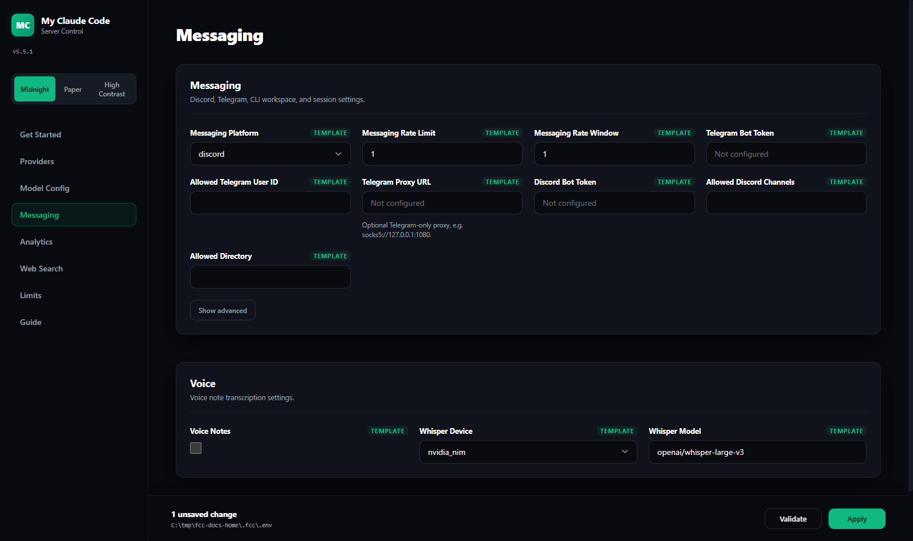
</div>

<details>
<summary><strong>Discord bot</strong></summary>

1. Create a bot in the [Discord Developer Portal](https://discord.com/developers/applications).
2. Enable **Message Content Intent** and invite it with read, send,
   message-history, and **Manage Messages** permissions so `/clear` can remove
   user prompts.
3. Set **Messaging Platform** to **discord**.
4. Enter **Discord Bot Token**, **Allowed Discord Channels**, and an absolute **Allowed Directory**.
5. Apply the settings and restart the server if requested.

</details>

<details>
<summary><strong>Telegram bot</strong></summary>

1. Create a bot with [@BotFather](https://t.me/BotFather).
2. Get your numeric user ID from [@userinfobot](https://t.me/userinfobot).
   In groups, grant the bot permission to delete messages.
3. Set **Messaging Platform** to **telegram**.
4. Enter **Telegram Bot Token**, **Allowed Telegram User ID**, and an absolute **Allowed Directory**.
5. Apply the settings and restart the server if requested.

</details>

### Messaging commands

| Usage | Behavior |
| --- | --- |
| `/stats` | Show session state. |
| Standalone `/stop` | Cancel all work. |
| Reply with `/stop` | Cancel only the selected request while other queued requests continue. |
| Standalone `/clear` | Reset all FCC state and remove every tracked message in that chat, including user prompts, voice notes, FCC replies, Telegram's online notice, and the clear command itself. |
| Reply with `/clear` | Delete the selected message and its literal platform reply subtree while preserving its ancestors and siblings. |

<details>
<summary><strong>Voice notes</strong></summary>

Re-run the installer with the voice backend you need.

macOS/Linux:

```bash
# NVIDIA NIM transcription
curl -fsSL "https://raw.githubusercontent.com/FiredMosquito831/free-claude-code/main/scripts/install.sh" | sh -s -- --voice-nim

# Local Whisper on CPU or CUDA
curl -fsSL "https://raw.githubusercontent.com/FiredMosquito831/free-claude-code/main/scripts/install.sh" | sh -s -- --voice-local

# Both backends
curl -fsSL "https://raw.githubusercontent.com/FiredMosquito831/free-claude-code/main/scripts/install.sh" | sh -s -- --voice-all

# Local Whisper with the CUDA 13.0 PyTorch backend
curl -fsSL "https://raw.githubusercontent.com/FiredMosquito831/free-claude-code/main/scripts/install.sh" | sh -s -- --voice-local --torch-backend cu130
```

Windows PowerShell:

```powershell
# NVIDIA NIM transcription
& ([scriptblock]::Create((irm "https://raw.githubusercontent.com/FiredMosquito831/free-claude-code/main/scripts/install.ps1"))) -VoiceNim

# Local Whisper on CPU or CUDA
& ([scriptblock]::Create((irm "https://raw.githubusercontent.com/FiredMosquito831/free-claude-code/main/scripts/install.ps1"))) -VoiceLocal

# Both backends
& ([scriptblock]::Create((irm "https://raw.githubusercontent.com/FiredMosquito831/free-claude-code/main/scripts/install.ps1"))) -VoiceAll

# Local Whisper with the CUDA 13.0 PyTorch backend
& ([scriptblock]::Create((irm "https://raw.githubusercontent.com/FiredMosquito831/free-claude-code/main/scripts/install.ps1"))) -VoiceLocal -TorchBackend cu130
```

Restart `fcc-server`. In **Admin UI → Messaging → Voice**, enable voice notes, select `cpu`, `cuda`, or `nvidia_nim`, and choose the Whisper model. Local gated models need `HUGGINGFACE_API_KEY`; NVIDIA NIM transcription needs `NVIDIA_NIM_API_KEY`.

</details>

## Manage Your Installation

### Update

Re-run the matching command from [Install Or Update](#install).

### Uninstall

Stop every running FCC command first. The uninstaller removes the FCC uv tool, verifies every FCC command is gone, and then deletes `~/.fcc/`. It leaves uv, Python, Claude Code, Codex, Pi, and shared PATH entries intact.

macOS/Linux:

```bash
curl -fsSL "https://raw.githubusercontent.com/FiredMosquito831/free-claude-code/main/scripts/uninstall.sh" | sh
```

Windows PowerShell:

```powershell
& ([scriptblock]::Create((irm "https://raw.githubusercontent.com/FiredMosquito831/free-claude-code/main/scripts/uninstall.ps1")))
```

## Configuration Reference

Every setting documented above — model providers, rotation policies, web search providers and advanced options, request/websearch logging, messaging, and voice — lives in [.env.example](.env.example) with inline comments and cost notes. Deep-dive research documents for the web search system are under [research/](research/); the internal architecture is covered in [ARCHITECTURE.md](ARCHITECTURE.md).

## Development

- Local CI sequence: `./scripts/ci.sh` (macOS/Linux) or `.\scripts\ci.ps1` (Windows) — Ruff format/check, `ty` type checking, and `pytest`.
- Individual commands: `uv run ruff format`, `uv run ruff check --fix`, `uv run ty check`, `uv run pytest -v --tb=short`.
- See [CONTRIBUTING.md](CONTRIBUTING.md) for the full workflow.

## Project Links

- [Report bugs or request features](https://github.com/FiredMosquito831/free-claude-code/issues)
- [Architecture and extension guide](ARCHITECTURE.md)
- [Contributing guide](CONTRIBUTING.md)

## License

MIT License. See [LICENSE](LICENSE) for details.
